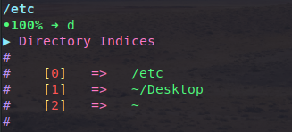

# Prettify-dirs

## How to use :-

1. Clone this repo 

    ```
    git clone https://github.com/alphadose/Prettify-dirs ~/.prettify
    ```

2. Add an alias to your ~/.bashrc or ~/.zshrc

    ```
    echo "alias d='dirs -v | head -10 | ~/.prettify/prettify'" >> ~/.zshrc
    ```

## Sample :-

